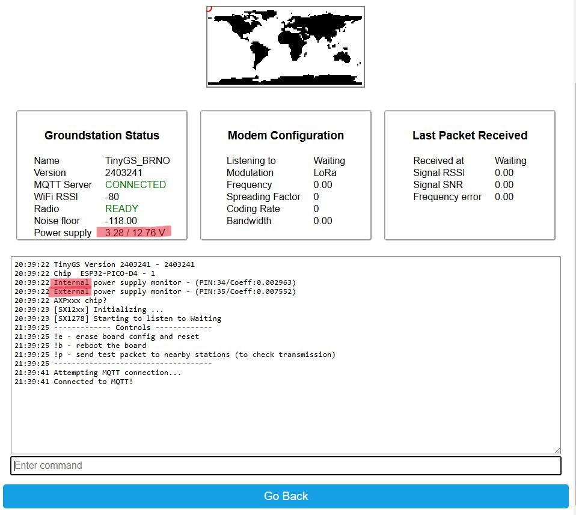
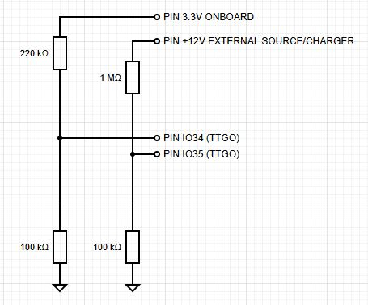
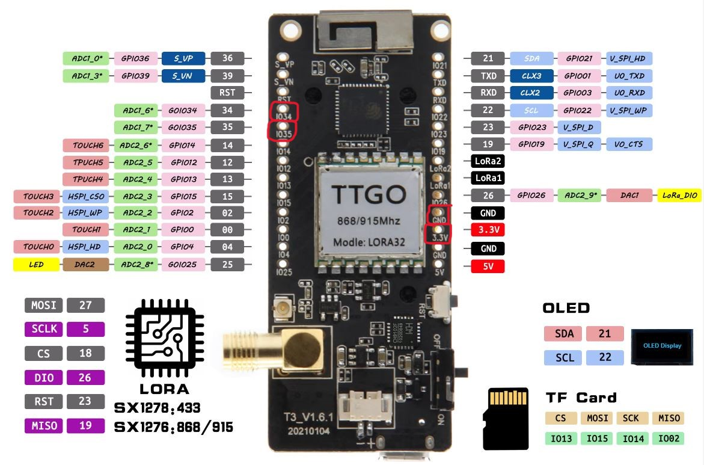
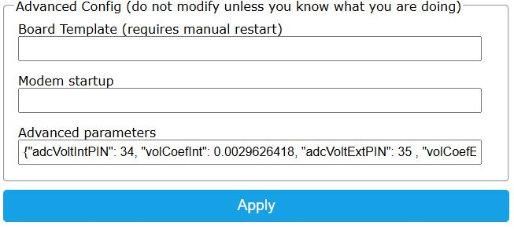

# Power Supply Monitoring Feature for TinyGS
 This feature introduces real-time monitoring of internal battery voltage and external power sources (e.g., charger, solar panel, Pb battery) using one/two analog pin(s) on the TTGO board. The feature displays power supply status continuously on the device Dashboard page. Implementation requires adding 4 resistors, basic wiring, extending the advanced configuration with a JSON parameter, and flashing the firmware built from the provided updated code. Simplify power management and enhance your TinyGS setup with this new capability!

 

 Although it was designed for the LILY TTGO board, this feature should work with any other board equipped with one or two analog (ADC) pins (e.g., HELTEC). You will need to adjust the settings in the advanced parameters configuration field based on the specific pins used.




If the advanced parameters parser detects power monitoring configuration parameters, the firmware will enable one or two power supply monitoring instances, displaying the corresponding voltages on the Dashboard page. 



The parameters required to activate the power monitoring feature are:
- **adcVoltIntPIN**: Analog **pin for internal** voltage measurement (integer - e.g. 34)
- **volCoefInt**: Voltage **coefficient** for internal measurement (float - e.g. 0.0075517320)
- **adcVoltExtPIN**: Analog **pin for external** voltage measurement (integer)
- **volCoefExt**: Voltage **coefficient** for external measurement (float)

The `volCoef` multiplication parameter is used for precise calibration of the voltage displayed on the Dashboard page. It is recommended to first complete all hardware modifications, flash the updated firmware, and then activate the feature by adding the required parameters in the JSON configuration. Initially, set `volCoef` to 1, observe the voltage displayed by the device, and compare it with the voltage measured using a voltmeter for the corresponding input. **Recalculate the `volCoef` parameter** as:

                            `volCoef`=  voltage_measured / voltage_presented

This ensures accurate voltage readings on the Dashboard. Here is an example configuration for the TTGO board I am using for one of my Tiny Ground Station:

```json
{
  "adcVoltIntPIN": 34,
  "volCoefInt": 0.0029626418,
  "adcVoltExtPIN": 35,
  "volCoefExt": 0.0075517320
}

This configuration specifies the analog pins used for internal (`adcVoltIntPIN`) and external (`adcVoltExtPIN`) voltage measurements, along with their respective calibration coefficients (`volCoefInt` and `volCoefExt`). Ensure these values align with your hardware setup for accurate monitoring. The more carefully you perform the calibration step, the more accurate and precise the voltage values displayed on the Dashboard page will be. Taking time to fine-tune the volCoef parameters ensures reliable and precise monitoring of power supply voltages.

In my setup, I am using this feature for a remote TinyGS node located in my garden, powered solely by an external 10Ah 12V Pb battery. This setup allows me to remotely monitor both the internal and external battery statuses. While the external Pb battery is occasionally charged via a solar panel, there are rare instances when it requires additional charging. This feature helps me prevent excessive discharging below 11V, which could otherwise damage the Pb battery and significantly reduce its capacity.

Enjoy this feature! Any suggestions or contributions are welcome, including code pushbacks. Meanwhile, I plan to submit a proposal to the TinyGS team for the inclusion of this feature in their official firmware.

<sub>Vilem Reznicek |TinyGS | Power Supply Monitoring | C++ | 2025 </sub>
